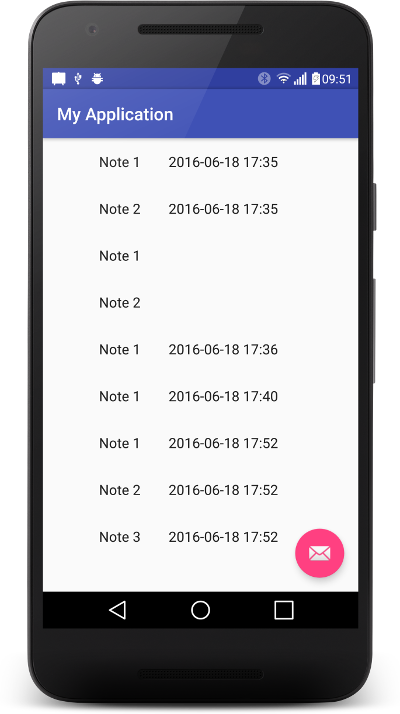

Firebase POJO list
===================================

The POJO ("Note") has an "created" public Object that is initialised with ServerValue.TIMESTAMP and will consequently be replaces in the server with the time.
There is also a public method like

    public Long getCreatedTimestamp() {
            if (created instanceof Long) {
                return (Long) created;
            }
            else {
                return null;
            }
        }

To notice that ServerValue.TIMESTAMP is a Map. Read more on this post http://stackoverflow.com/questions/33096128/when-making-a-pojo-in-firebase-can-you-use-servervalue-timestamp?lq=1

Screenshots
-------------

